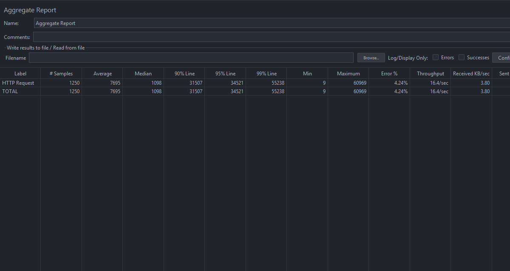
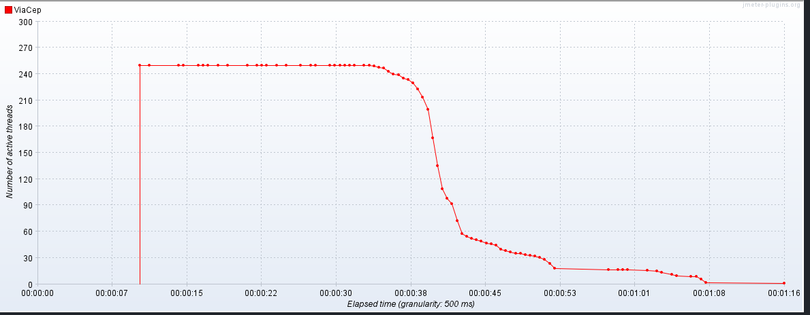

# Avaliação de Desempenho da API REST - ViaCEP

Este projeto tem como objetivo avaliar o desempenho da API REST implementada para consultar o ViaCEP, medindo diversos parâmetros de desempenho, incluindo tempo de resposta, taxa de transferência, erro percentual, conexões ativas e pico de conexões.

## Endpoint Testado

`http://localhost:3000/cep/44004100`

## Parâmetros

- **Number of Threads**: 250
- **Ramp-Up Period**: 10 segundos
- **Loop Count**: 5

## Resultados do Teste

### Tempo de Resposta

- **Tempo de Resposta Médio**: 7695 ms
- **Tempo de Resposta Mínimo**: 9 ms
- **Tempo de Resposta Máximo**: 60969 ms
- **Throughput**: 16.4 requisições/segundo
- **Error %**: 4.24%

### Erro Percentual

- **Error %**: 4.24%  
  Durante o teste, houveram erros de requisição.

### Pico de Conexões Ativas

O gráfico a seguir mostra que o número de **Active Threads** (conexões ativas) atingiu entre 240 e 270 durante o teste. Esse pico ocorreu entre **00:00:07** e **00:00:45**, indicando um período em que o servidor estava sob carga máxima.

## Conclusão

A análise de desempenho da API REST para consulta ao ViaCEP revela pontos críticos sob a carga de teste aplicada. Foi observada uma **taxa de erro de 4,24%** e um tempo de resposta médio elevado de **7695 ms**, com picos de até **60969 ms**. Esses números indicam que a aplicação apresentou instabilidade e degradação de performance sob estresse.

A causa mais provável para esses problemas é o bloqueio de IP identificado durante os testes, que sugere a existência de um mecanismo de limitação de requisições (_rate limiting_) por parte do serviço externo ViaCEP. Portanto, os erros e a alta latência podem não ser uma falha da API em si, mas uma consequência da dependência de um serviço externo com restrições.

Para avaliações futuras, é crucial considerar esses limites. Estratégias como o uso de _mocks_ para o serviço externo ou a distribuição de carga em um período maior podem fornecer uma medição mais precisa do desempenho real da sua aplicação, isolando-a de fatores externos.
